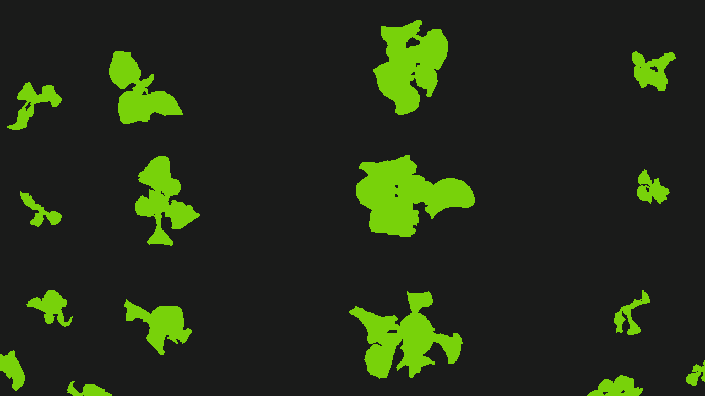
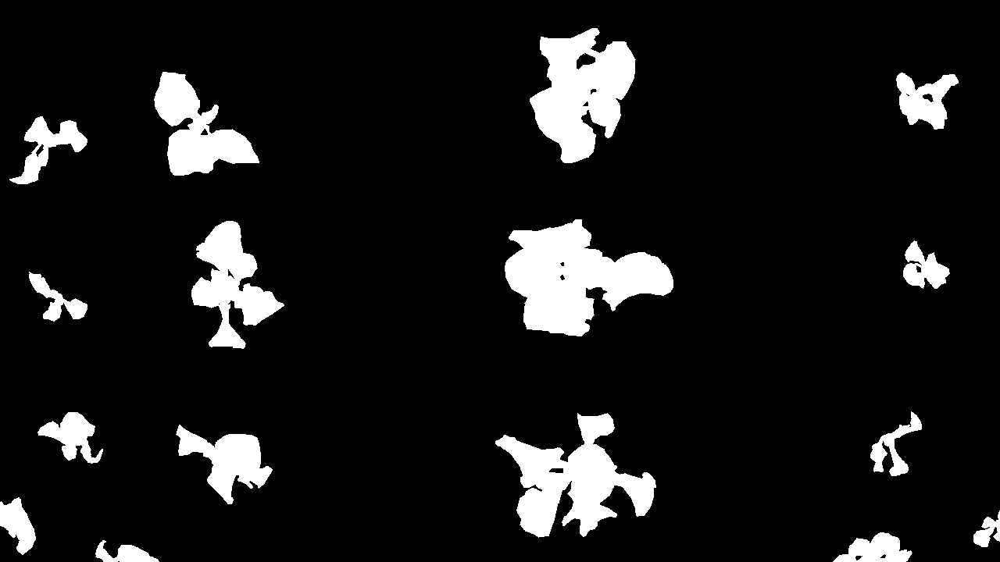

# Image toolkit for masking process

## mask2palette&#46;py
Convert mask images (value: 0,1,2,...) to RGB image with the palette colors.

## palette2mask&#46;py
Convert RGB images to mask images which is MMsegmentation friendly.

## overlap&#46;py
Check if mask is fitting to input images.

### Conversion explains the relation between value of mask and color of palette.
key: value of mask \
value: color of palette